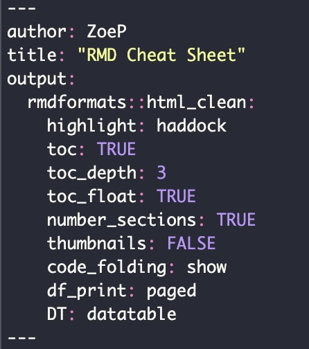

```{r setup, include=FALSE}
knitr::opts_chunk$set(include = FALSE)
```

# YAML Headings

-   Always begin an RMD file with a YAML header

-   This header can include things like author name and title, as well as useful settings like creating a table of contents (check the code on this document for an example)

Here are some examples of YAML headings:

<center>{width="197"}</center>

# Reading in data

-   R

# Loading libraries

# Text formatting

# Lists

# Headers

# Tabsets

# Code chunks

# Figures

# Table outputs

# Images

-   Adding images to the RMD file is relatively simple in visual mode

-   First, make sure the image you want to add is saved to the images folder in the directory you're working out of (jpeg works best for me, other formats may work as well)

-   Then, click the image icon in the editing ribbon of visual mode.

-   From there, navigate to the image you'd like to add, add captions and other fun stuff, then you're done!

-   You can center an image by adding center before it and /center after! Just make sure they are enclosed in \<carrots\>

# Hyperlinks

# LaTex

# Citations

-   By adding a refrences folder to yourt directory, you can easily add citations

-   Select "insert" in visual mode and click citation, if you have a refrence manager like Zotero on your computer, it should find all of your preexisting refrences.

-   Here's an example:

    [@bruun1988]
