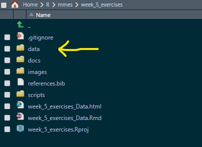
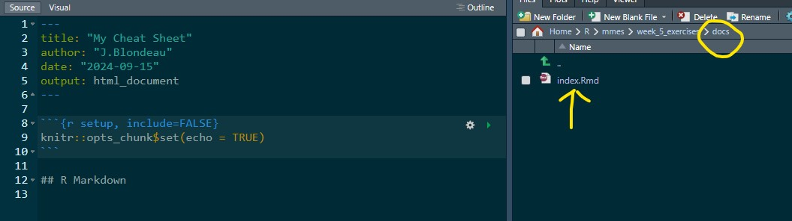
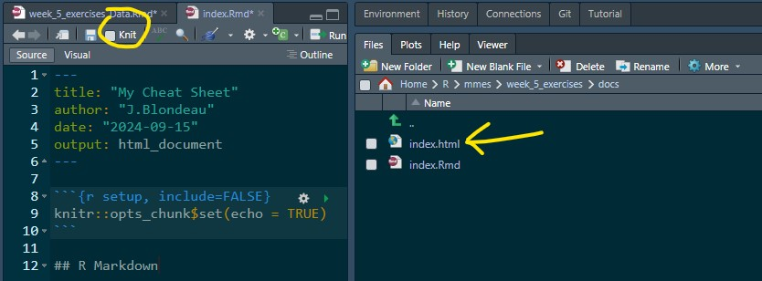
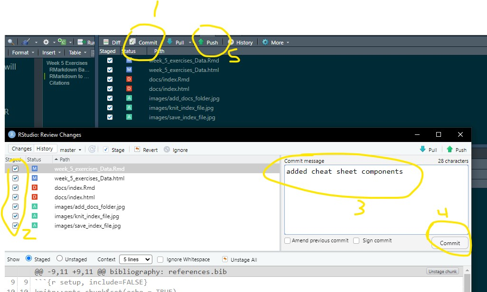
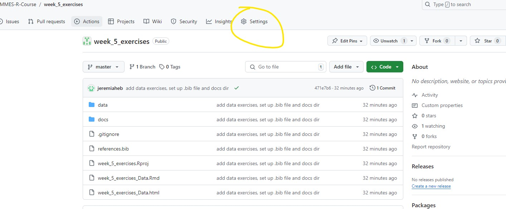

```{r setup, include=FALSE}
knitr::opts_chunk$set(echo = TRUE)

```

# Week 5 Exercises {.tabset}

**J.Blondeau\
2024-9-19**

## RMarkdown Basics

This week will you will get some practice creating an R markdown document and then serving it on GitHub pages as a static website.

The exercise today will be fairly simple. I would like for you to create an R markdown document to be your personal cheatsheet on the markdown syntax. Something you can refer back to that is on your personal GitHub page.

Your cheatsheet should have text and examples to help you learn and come back to when needed.

At a minimum, your document should have examples on..

1.  YAML settings
2.  Reading in data
3.  Loading libraries
4.  Text formatting
    -   italics, bold,
5.  Ordered and numbered lists
6.  Section headers
7.  Tabsets
8.  Code chunks
    -   with code chunk options (i.e echo = , eval = )
9.  Inserting figures
    -   and figure captions
10. Table outputs
11. Inserting Images
12. hyperlinks
13. Formulas with LaTeX
14. Citations ( I like using DOI) [@grove2024] [@heidmann2024]

------------------------------------------------------------------------

Here are a few helpful resources: <br> [pimp my r markdown](https://holtzy.github.io/Pimp-my-rmd/) <br> [R markdown: definitive guide](https://bookdown.org/yihui/rmarkdown/) <br> [More markdown syntax, including LaTeX](https://ashki23.github.io/markdown-latex.html)

## RMarkdown to Github Website

1.  Create (if not already) a 'docs' directory in your main project directory

    

2.  Create a new RMarkdown (.Rmd) file and then save the file in the docs directory with the name "index"

    

3.  Edit your index.rmd file

    This is where you will make all the document edits.

4.  Knit the .rmd file. R will create an index.html file for you

    

5.  Commit and push everything up to your github account

    1.  On the Git tab, click on Commit button

    2.  Toggle all the files you would like to commit and save

    3.  Add a clear and succinct commit message

    4.  Save commit

    5.  Push all the changes to your Github

    

6.  Now navigate to your github account and find your week_5 repository

7.  Go to the settings tab

    

8.  Then from the settings menu

    1.  Click on 'Pages' tab

    2.  Change Branch to Master

    3.  Change folder to /Docs

    4.  Then Save

9.  After a few minutes, refresh the setting page and Github will host your RMarkdown document with its own URL

## Citations
